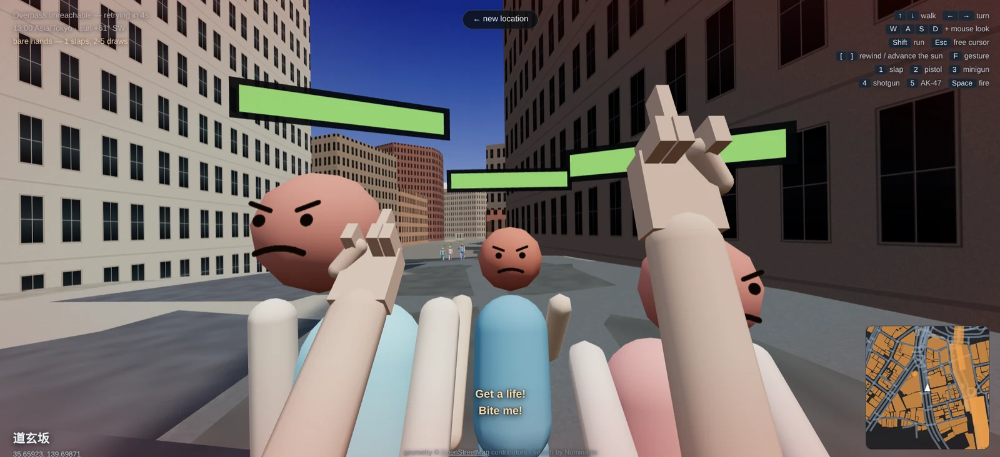
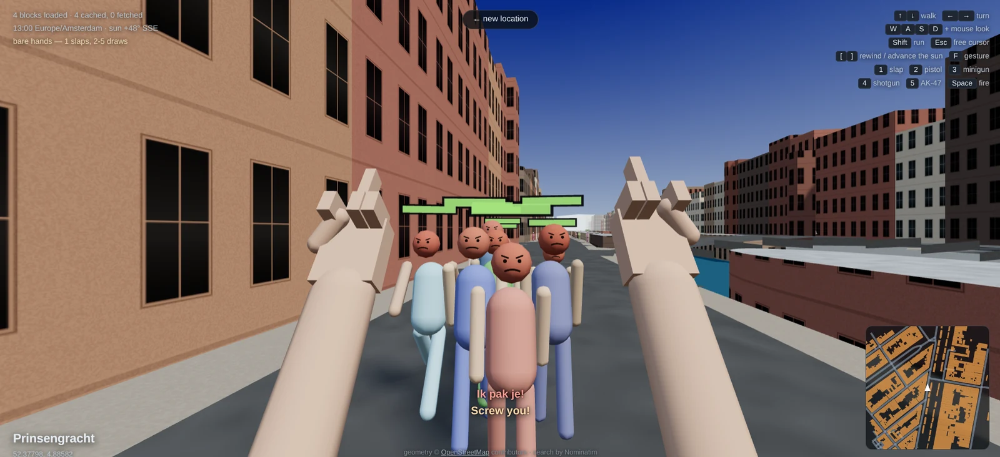
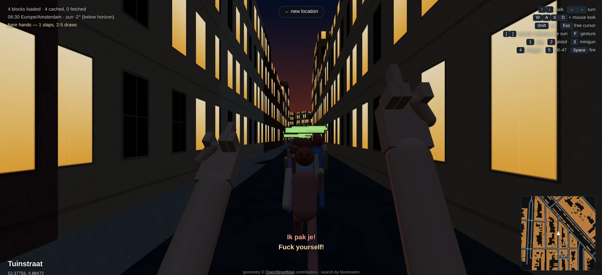
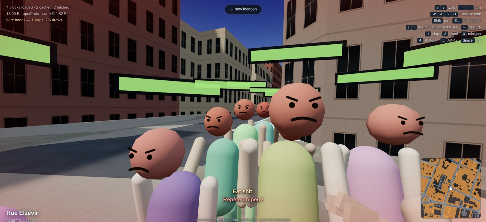

# HTML City

Type an address. Land in it. Walk away down the street.

A single HTML file that pulls a real city out of OpenStreetMap and rebuilds it as
walkable 3D geometry in the browser. Search `Prinsengracht 263, Amsterdam`, press
Enter, and a moment later you are standing on the quay in first person with the
arrow keys under your fingers. Keep walking and the next blocks are fetched and
built in front of you, so there is no edge of the world to bump into.

The city is furnished. Real elevation, so hills are hills. Canals sunk behind
their quay walls with houseboats floating on them, and arched bridges you walk
over. A sun placed by actual astronomy for that latitude, longitude and moment,
with windows that light up after it sets. Pedestrians walking the street network
alone and in twos and threes, solid enough to shoulder past, who talk to each
other in the language of wherever you happen to be standing — and who take it
personally if you are rude to them.

No build step, no bundler, no `node_modules`, no API keys, no account. One HTML
file of about three thousand lines, plus a vendored copy of three.js — so the
only thing it needs from the network at runtime is the map data itself.

| | |
|---|---|
|  |  |
| Dōgenzaka, Shibuya — a crowd that has had enough of you | Prinsengracht, Amsterdam — *"Ik pak je!"* |
|  |  |
| Tuinstraat at 06:30, sun 2° below the horizon | Rue Elzévir, Le Marais — *"Répète un peu !"* |

## Run it

```bash
python3 -m http.server 8777
# then open http://127.0.0.1:8777/index.html
```

It is entirely static: there is no server-side process, and your host never
makes an outbound request of its own, because every API call is made by the
visitor's browser. Any static server will do — nginx, Apache, Caddy, S3, GitHub
Pages. It does have to be served over `http://` or `https://` rather than
`file://`, or the module import and the API calls are blocked. Every external
origin it touches is HTTPS, so there is no mixed-content problem on a TLS site.

Jump straight to a spot with a hash:

```
http://127.0.0.1:8777/index.html#52.3752,4.8840
```

The hash follows you as you walk, so any place you find is a shareable link.

## Controls

| | |
|---|---|
| <kbd>↑</kbd> <kbd>↓</kbd> | walk forward / back |
| <kbd>←</kbd> <kbd>→</kbd> | turn |
| <kbd>W</kbd><kbd>A</kbd><kbd>S</kbd><kbd>D</kbd> | walk and strafe |
| mouse | look around — click once to capture the pointer, <kbd>Esc</kbd> to release |
| <kbd>Shift</kbd> | run — 12 m/s against 1.9 walking |
| <kbd>[</kbd> <kbd>]</kbd> | rewind / advance the sun by 15 minutes |
| <kbd>F</kbd> | hold to express an opinion — they notice |
| <kbd>1</kbd> | slap, and put away whatever you were holding |
| <kbd>2</kbd>–<kbd>5</kbd> | pistol, minigun, shotgun, AK-47 |
| <kbd>6</kbd> <kbd>7</kbd> | grenade, molotov — hold <kbd>Space</kbd> to throw further |
| <kbd>8</kbd> | spell book — hold <kbd>Space</kbd> and lightning falls where you look |
| <kbd>Space</kbd> | fire |

The search box takes a street address, a place name, or a raw `lat, lon` pair.

Options on the start page: detail radius (how big a tile is), shadows, whether
your own arms are drawn, whether anyone else is about, and the hour — which
defaults to one in the afternoon so you land in daylight. Tick **sun at local
time now** to get the real sun for the current moment instead.

### What has to be on the server

Two things, and the second is easy to forget:

```
index.html
vendor/three.module.min.js      ← the page will not start without this
vendor/LICENSE-three.txt        ← not needed to run; ship it anyway, three.js is MIT
```

`screenshots/` is only for this README and does not need deploying. There are no
other local files: everything else the page uses comes from the APIs above.

Worth splitting the cache headers, since the two files age very differently:
`index.html` changes with every edit, while the vendored library has changed
once, ever, and is byte-identical to the upstream release. Telling the browser
so means a returning visitor re-fetches 160 kB rather than 830 kB.

```nginx
location = /htmlcity/index.html      { add_header Cache-Control "no-cache"; }
location ^~ /htmlcity/vendor/        { add_header Cache-Control "public, max-age=31536000, immutable"; }
```

That is also the argument against inlining three.js into the page: it would
chain a never-changing 672 kB to a frequently-changing 160 kB.

If `vendor/` is missing the import map fails, the module never executes, and the
symptom is a page that renders but does nothing — the search box in particular
just sits there. Check it directly rather than guessing:

```bash
curl -o /dev/null -w '%{http_code}\n' https://your.site/htmlcity/vendor/three.module.min.js
```

## Where the data comes from

Everything is public and free, and nothing is scraped.

- **[OpenStreetMap](https://www.openstreetmap.org/copyright)** via the **Overpass
  API** — building footprints, heights, roads, canals, bridges, parks. Requested
  per tile as you move, from three mirrors with automatic failover.
- **[Nominatim](https://nominatim.openstreetmap.org/)** — turns what you type into
  a latitude and longitude.
- **[Terrarium elevation tiles](https://registry.opendata.aws/terrain-tiles/)**
  on AWS Open Data — 8-bit RGB where `height = R*256 + G + B/256 - 32768` metres.
  Free, no key, CORS-open, which matters because the pixels have to be read back
  off a canvas.
- **[three.js](https://threejs.org/) r169** — WebGL rendering. Vendored into
  `vendor/` (MIT, licence included) and wired up with an import map, so there is
  no CDN in the runtime path and the page cannot be broken by someone else's
  outage. Swap in the unminified `three.module.js` from the same release if you
  ever want to step through it in a debugger.

A note on Google, since it is the obvious question: the Blender plugin that does
something similar (Blosm) uses OpenStreetMap for its free path. Scraping Google
Maps is against their terms; the legitimate Google route is their paid
Photorealistic 3D Tiles API, which needs a billing-enabled key and carries
attribution requirements. OSM gets you a walkable city for nothing, and in
Amsterdam it is genuinely excellent data — see below.

## How it works

**Projection.** The first location you pick becomes the origin. Everything after
that is a local east/north plane in metres, which is accurate to well under a
centimetre across the few kilometres you can actually walk.

**Buildings.** Footprints are extruded by hand rather than with `ExtrudeGeometry`,
so each wall quad gets a UV mapped to real metres — one texture repeat is 6 m of
street frontage by 6.6 m of height. That is what makes the window rows line up at
a believable size instead of stretching to fit whatever the footprint happens to
be. Roofs are triangulated with holes, so courtyards stay open. Heights come from
the `height` tag, else `building:levels × 3.25`, else a guess.

Amsterdam is close to the ideal test case: in a sample tile of the Jordaan, 1289
of 1470 buildings carry a surveyed height, because the Dutch BAG/3DBAG cadastre
has been imported into OSM. Median building height 13.5 m, median footprint 78 m²
— narrow canal houses, exactly right.

**Terrain.** Elevation comes from Terrarium tiles at zoom 13, resampled once per
location into a 12 m grid in local metres and expressed relative to your landing
point, so the scene stays near y=0 whether you start in Rotterdam or La Paz.

The field is blurred before use. At zoom 13 a pixel is about 12 m across and in a
dense city the source behaves more like a surface model than a bare-earth one —
Amsterdam's canal-side streets read 6.8 m because rooftops leak into the sample.
Smoothing costs nothing real, since what we want is the ground, not the roofs.

Surfaces are draped by adaptive tessellation: a triangle splits only while the
ground disagrees with the flat version of it by more than 0.25 m. A uniformly
*tilted* plane needs no splitting at all — only curvature does — so a hillside
costs little and Amsterdam costs nothing. Measured: land came to 3229 triangles
across four Amsterdam tiles and 150 on a San Francisco slope.

Buildings are stood on the high side of their own footprint and their walls
carried 1.5 m below the low side, so a slope cuts into them instead of daylight
showing underneath. Water is the exception to draping: it is set level from the
ground at the middle of each body, because water does not run up a hill, and the
quay wall then follows the bank down to meet it. Roads are subdivided to 14 m
before being ribboned, or a long straight would cut through a rise, and bridges
spring from the ground at each end. If the DEM cannot be fetched, `groundAt`
returns zero everywhere and the old flat world is intact.

**Boats.** A "building" whose footprint sits on the water is a houseboat, not a
house — Amsterdam is full of them, and extruded to four storeys they look
absurd. Water is read before buildings in each tile so the overlap can be seen,
and anything afloat is capped to a single storey of cabin over a hull sitting in
the water. In one Jordaan tile that is 97 boats against 2588 houses.

**Canals.** Water sits 1.9 m below street level behind a stone quay wall, which is
what actually makes a canal read as a canal rather than blue paint. That means the
ground cannot be one big plane, or it would cover the water; instead every tile
draws its own land quad with the canal polygons clipped to the tile square and
punched out as holes.

**Bridges.** Ways tagged `bridge` are subdivided and arched on a sine profile, get
a deck with visible sides, and are registered as walkable surfaces — so the camera
rides up over the span and back down the other side.

**The sun is real.** Rather than a few canned lighting presets, the low-precision
NOAA solar position algorithm places the sun from the actual latitude, longitude
and moment — by default, right now, wherever you are standing. It is accurate to
a hundredth of a degree at the solstices, and it gets the southern hemisphere
right: in Sydney in January the sun is correctly in the *north*. Sky gradient,
fog, sun colour and bounce light all interpolate off solar altitude, and the
windows light up once it drops below the horizon. Scrub the hour with
<kbd>[</kbd> / <kbd>]</kbd> and you can watch the shadows swing round the street.

The clock beside it is real civil time in that city. The sun itself only needs a
UTC instant, so it is correct either way, but showing the right *wall* time needs
the actual zone — that comes from a one-shot lookup on `timeapi.io`, after which
`Intl` handles DST and half-hour offsets exactly. If the lookup fails the clock
falls back to longitude, which stays solar-sane but drifts from the wall clock by
the DST offset.

**Reading the HUD.** A weapon bar along the bottom, built from the same table
the number keys read so it cannot drift out of step with them, with the selected
slot lit. A counter top-left for how many people are about and how many you have
killed, reset when you change location. And:

**Service dots.** Four things are asked for over the network — map data,
geocoding, elevation, time zone — and any of them can be having a bad day. Four
dots in the top-left report what actually happened on the last call rather than
pinging anything, so they cost nothing and cannot lie: grey untouched, amber in
flight, green answered, red failed. They sit above the start screen too, so you
can see a service is down before you go looking for a street.

**Why the cache is in the browser.** Each visitor talks to Overpass directly and
keeps what they get in their own IndexedDB. That means N visitors cost Overpass
N queries — but from N different addresses, so no single one is ever the noisy
client. Putting a cache on the server inverts that: total queries collapse to
roughly one per tile ever, which is kinder in aggregate, but every request then
leaves from one IP, and Overpass does not throttle a noisy client so much as
firewall it. Concentrating the misses concentrates the risk.

If you do want it, requests are sent as GET rather than POST — about 1.5 kB of
URL, well inside any limit — precisely so an ordinary HTTP cache can key on
them; a POST body is not a cache key anywhere without special configuration. Set
`OSM_PROXY` near the top of the file to a path on your own origin and it is
tried first, with the public mirrors left as the fallback. Nothing else changes,
and with it empty the page stays hostable anywhere static.

**Streaming, politely.** The world is 600 m tiles, and the grid is pinned to the
globe rather than to wherever you searched from — so two visits to the same
street ask for the same cells whatever address you arrived by, and the second
visit is free. Every tile is cached in IndexedDB for a fortnight, so reloads cost
nothing at all.

Tiles are fetched only when you can actually see into them: one while you are
mid-cell, never more than four, instead of firing the whole surrounding nine the
moment you land. The queue is drained nearest-first rather than oldest-first, and
entries you have walked away from are dropped — walking into a new part of town
should load the ground under your feet before the ground you left. One request is in flight at a time with a real pause between
them, and Overpass pushing back triggers an exponential retreat rather than a
retry storm. This matters — Overpass does not politely throttle a noisy client,
it firewalls the IP, and a refused TCP connection surfaces in the browser as a
bare `Failed to fetch`. If you see that, you are blocked rather than offline; it
clears on its own.

Ways are deduplicated by OSM id across tiles, and tiles are disposed of once
everything they built is more than 900 m from you — by where the geometry
actually is, not by which cell it was fetched for. Overpass returns every way
that *touches* a tile, with its full geometry, so a tile can own something far
larger than itself: the IJ is a single polygon 1792 m across. Disposing on grid
distance deleted that polygon while you were still standing on its bank. A hard
cap sheds the furthest tiles as a backstop, since a few own enough geometry that
they would otherwise never qualify. A way belongs to
whichever tile first fetched it rather than to the ground beneath it, so anyone
walking a street whose owning tile gets dropped is moved to the nearest live
segment instead of blinking out.

People are retired by distance from where they actually are. That sounds obvious
and was not: the check originally measured from the first vertex of the segment
they were walking, and a straight can run 260 m. On Bloemgracht someone standing
77 m away measured 206 m by that rule and was culled in plain sight.

**Collision.** Building footprints go into a 24 m spatial grid; movement is tested
against the polygons in the neighbouring cells and slides along walls rather than
stopping dead.

**View arms.** Two arms parented to the camera, swinging on the same phase as
the head bob so they keep step with your actual pace, sliding out of frame when
you stand still. Toggle them off on the start page.

Two things are worth knowing if you ever move them. The upper arm is deliberately
not drawn: the shoulder sits behind your eyes, so a mesh there puts geometry
across the near plane, and geometry straddling the near plane smears across the
entire screen — the giveaway is a positive camera-space z on the arm's bounding
box. The pivot still drives the forearm; you simply never see your own upper arm
in first person. And the whole pose is solved rather than eyeballed: the shoulder
angles are chosen so both hands stay framed through the full swing while the
elbow stays below the viewport, which is worth re-checking if you change the
field of view.

Hand roll is a single expression, `-side * PI * (1 + f) / 2`, where `f` is how
far into the gesture you are. A quarter turn gives palms inward with the thumbs
riding on top, which is how hands sit when you run; a half turn presents the
palm to the camera.

**People.** Pedestrians walk the road graph, sometimes alone and sometimes in
twos and threes keeping pace together. They are drawn as six `InstancedMesh`
objects — head, torso, two legs, two arms — so the whole crowd is six draw calls
however many are out, with per-instance colour for clothing and skin. Each one
follows a way at a sidewalk offset, takes another way at each junction (OSM ways
share endpoint nodes, so the junctions fall out of the data for free — 147 of
them in one Jordaan tile), and turns on its heel at a dead end. They ride bridge
decks like you do.

**Consequences.** Everyone carries a health bar above their head, billboarded on
yaw so it stays upright. <kbd>1</kbd> slaps whoever is in front of you for a
little damage and holsters whatever you were carrying — which is what restores
the two-handed gesture, since a hand on a grip cannot also make a point.
<kbd>2</kbd>–<kbd>5</kbd> draw the arsenal and <kbd>Space</kbd> fires it. The
report is synthesised with WebAudio rather than shipped as a file, so the page
stays one document; each weapon just shifts the filter sweep and envelope.

| | shots to kill | rate | reach | carries through |
|---|---|---|---|---|
| pistol | 3 | 2.9/s | 70 m | 1 |
| minigun | 2 | 13.3/s | 90 m | 2–3 |
| shotgun | 2 | 1.2/s | 26 m | 1–2 |
| AK-47 | 3 | 9.1/s | 85 m | 2 |

A round carries through the nearest N people along the sightline, N rolled per
shot from the weapon's range. The minigun's six barrels idle slowly and wind up
while the trigger is down.

**Thrown.** <kbd>6</kbd> and <kbd>7</kbd> are charged rather than fired: hold
<kbd>Space</kbd> to wind up and release to throw, and the arm draws back as it
charges. A tap lobs about 9 m, a full second and a bit reaches 36 m, measured
9.1 / 15.3 / 20.4 / 27.7 / 35.7 m across the charge range. It leaves along your
eyeline, so looking up throws further.

The grenade cooks off on a fuse wherever it has bounced to, and does 0.30 damage
at the edge of a 9 m radius rising to 1.45 at the centre. The molotov breaks on
first contact instead — ground or wall — and leaves a pool that burns anyone
standing in it at 0.55 a second for nine seconds, and sends them running. Three
point lights are created once and re-pointed at whichever fires are nearest,
because adding and removing lights forces every material to recompile.

**The spell book.** A third firing model again: not a shot and not a throw, but
held down. An open book with something bright between the pages, and while
<kbd>Space</kbd> is down a bolt falls out of the sky onto whatever you are
pointing at. The aim walks your eyeline until it meets ground or wall, then the
bolt is drawn as twelve segments jagging down from 42 m up, re-jagged on a timer
rather than every frame — every frame strobes. Brightest at the base, with a
flash, a light and rolling thunder over a sustained hum. It burns anything
within 3.2 m of where it lands and sends them running. Verified: aimed 35° down
it struck 2.5 m ahead against 2.4 m predicted, sitting on the ground.

**Faces.** Four expressions drawn to canvas — happy, level, unhappy, wretched —
one `InstancedMesh` each, with every person written into exactly one, so all
four together cost only as many matrix writes as there are people. Everyone
starts cheerful. Fingers count for a little, bullet wounds for three times as
much, and being caught in a stampede for its own share.

A gunshot carries 45 m. Most people within earshot bolt at 3–3.9 m/s; about
three in ten decide you are the problem and come for you instead. Measured on a
single shot: three gave chase, two ran. The dead stay where they fall, with a
pool spreading under them for a second and a half, until they are far behind you
or the backlog passes forty-five.

**They talk.** Speech goes through the Web Speech API, so nothing is shipped and
the browser supplies the voices; whatever it says also appears as a subtitle, so
it still lands when there is no voice installed for that language.

Which language depends on where you are standing — one reverse geocode per
location gives a country, and 97 of them map to a tongue. Two country codes are
traps worth naming: `ar` is Argentina, not Arabic, and `sv` is El Salvador, not
Sweden. Both want Spanish. There are 29 languages of phrases, in three registers:
what they snap back when you flip them off, what they shout while running you
down, and what two people walking together say to each other. You answer in
English, because you are evidently a tourist.

Plenty of machines have no Devanagari, Thai or Hangul installed, and a subtitle
in one of those then reads as a row of empty boxes. Speech is unaffected — a
voice does not need a font — so the page probes at startup which scripts it can
actually draw, by comparing each against a private-use codepoint that is
guaranteed to have no glyph. Where a script comes out as tofu the subtitle falls
back to a romanisation of the same line while the synthesiser still says the real
one. All 79 non-Latin phrases carry one. Scripts your machine *can* draw are left
alone, so installing a font (`fonts-noto` covers the lot) simply gets you the
original text back.

Utterances are prioritised rather than queued — you and whoever answers you come
first, a pursuer next, passing chatter last — because the synthesiser's own queue
runs seconds behind the action once a street gets busy.

They also mind being flipped off. Hold <kbd>F</kbd> where someone can see it —
within 14 m, in front of you, and not facing away — and their face reddens. Do it
to the same person twice and they abandon their errand and come after you,
leaning in, pumping their arms and holding station about 1.4 m off your shoulder.
They manage 2.3–2.65 m/s against your 6 m/s run, so you can walk into trouble but
you can always outrun it. Offence is taken on the rising edge of the gesture, so
holding the key does not stack.

They are spawned and retired in a ring around you, on the nearest street that
qualifies rather than the first one drawn: picking the first spreads people
evenly over the whole 30–130 m ring, and since the streets behind you are already
loaded while the ones ahead are not, that leaves the crowd where you came from.
Walking 350 m from a standing start, the median distance from you settled at 39 m
with not one person closer to where you began than to where you are.

The shortlist itself is of nearby segments, refreshed as you move — sampling uniformly from every
loaded road mostly misses, because the tiles cover well over a square kilometre.
Population is topped up in a burst rather than one group per frame, so the crowd
size does not depend on how fast your machine renders. Toggle them off on the
start page.

## Textures, and the street-view question

The facades are procedurally drawn to a canvas — plaster grain, storey bands,
window reveals, glazing bars — and UV-mapped in real metres so the window rhythm
is 3 m regardless of building size. Open alternatives, in order of how much they
buy you:

- **CC0 material libraries** — [ambientCG](https://ambientcg.com/) and
  [Poly Haven](https://polyhaven.com/textures) publish photogrammetry-derived PBR
  brick, plaster, roof and paving sets under CC0. Public JSON APIs, CORS open, no
  attribution required. A curated dozen keyed off region would be the single
  biggest visual upgrade here, with no coverage gaps and no licence friction.
- **OSM's own appearance tags** — `building:colour`, `building:material`,
  `roof:colour`, `roof:shape`. Free and already in the Overpass response, but the
  coverage is thin: in the Jordaan sample tile, 87.4% of buildings carry a
  surveyed *height* and only 0.1% carry a colour. Worth honouring where present,
  but it will not carry a city.
- **[KartaView](https://kartaview.org/)** — open street-level photography,
  CC BY-SA. Genuinely frictionless: no token at all, `Access-Control-Allow-Origin: *`,
  and it returns geotagged JPEGs with a compass heading. There is a 2021 shot
  three metres from the Prinsengracht spawn point.
- **[Mapillary](https://www.mapillary.com/)** — much larger coverage, same
  CC BY-SA licence, but needs a free OAuth token.

Projecting that photography onto the walls is the obvious next thought, and it is
harder than it looks. The imagery is shot from car dashboards: the lower third is
windscreen and bonnet, and the facades you want are behind bikes, trees, bollards
and pedestrians. Doing it properly means multi-view fusion plus semantic
segmentation to mask out the clutter, then relighting to reconcile exposures —
which is why the pipelines that do this well are large. A far cheaper use of the
same data is to show the nearest real photo in a corner panel as you walk, so you
can hold the model up against the street it came from.

Google Street View imagery is not an option regardless — using it this way is
against their terms.

## Known limits

- **Roofs are flat.** No gables, spires or domes; OSM's `roof:shape` is ignored.
- **You can walk over water.** Canals are not solid, because making them solid
  would strand you whenever a bridge is missing from the data. You float across.
- **Interiors do not exist.** These are hollow shells with no doors.
- **Pedestrians keep to the pavement.** They are solid to each other and to you,
  and they will not walk through a building or across open water — a bridge deck
  counts as ground, which is what sends them to the bridges. If OSM forgets to
  tag a bridge, though, they will still walk across the water there, because
  nothing is pathfinding: they follow the ways they are given.
- **You can still walk on water yourself.** Only the crowd is held to dry land,
  since blocking you could strand you wherever a bridge is missing.
- **Timers run on a clamped delta.** `dt` is capped at 0.1 s so a stall cannot
  teleport you, which means on a machine rendering below 10 fps every cooldown
  stretches proportionally.
- **Landmark heights are guessed** when OSM has none, so the odd church tower is
  the wrong size.
- **Overpass is a shared free service** run on donated hardware. Tiles are cached
  and paced to stay well inside its limits, but it is still someone else's
  machine. Two of the three configured mirrors resolve to the same host, so the
  failover is thinner than it looks.

## Poking at it

Everything is exposed on one console handle:

```js
city.player           // { x, z, y, yaw, pitch }
city.tiles            // loaded 600 m blocks
city.go(52.37, 4.89)  // teleport
city.solarPosition(new Date(), 52.37, 4.89)   // { alt, az } in radians
city.bridges          // walkable decks
```

## Licence and attribution

Map data © OpenStreetMap contributors, [ODbL](https://www.openstreetmap.org/copyright)
— the attribution shown in the corner needs to stay if you publish this anywhere.
Geocoding by Nominatim, subject to its
[usage policy](https://operations.osmfoundation.org/policies/nominatim/).
